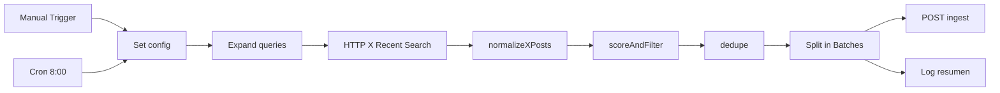

# Workflow n8n: Notitendencias - X AI Radar

Orquesta la consulta a la API de X, normalización, scoring, deduplicación e ingesta en Notitendencias.

| Campo | Valor |
|-------|--------|
| **Nombre** | `Notitendencias - X AI Radar` |
| **ID** | `nFBNa3Y1ueVHBLbc` |
| **URL** | https://n8n.vibesystems.tech/workflow/nFBNa3Y1ueVHBLbc |
| **Estado** | **Inactivo** hasta configurar variables y habilitar nodos HTTP |

Código fuente del workflow (SDK): [`scripts/n8n-x-ai-radar-workflow.sdk.ts`](../scripts/n8n-x-ai-radar-workflow.sdk.ts)

---

## Variables en n8n

Configurar en **Settings → Variables** (o credenciales) del entorno n8n:

| Variable | Ejemplo | Notas |
|----------|---------|--------|
| `X_BEARER_TOKEN` | (secreto) | API v2 Bearer de X Developer Portal |
| `X_API_MAX_POSTS_PER_RUN` | `50` | Límite por ejecución |
| `NOTITENDENCIAS_INGEST_URL` | `https://notitendencias.iareal.net/api/bridge/ingest` | |
| `BRIDGE_API_KEY` | (secreto) | Igual que en la app |

**Checklist (faltantes hasta que los configures en n8n → Settings → Variables):**

- [ ] `X_BEARER_TOKEN`
- [ ] `BRIDGE_API_KEY`
- [ ] `NOTITENDENCIAS_INGEST_URL`
- [ ] `X_API_MAX_POSTS_PER_RUN` (opcional; default lógico 50, beta usa `max_results` ≤ 10)

Lista editable en el nodo **Set config** (JSON):

```json
{
  "keyAccounts": ["OpenAI", "AnthropicAI", "GoogleDeepMind", "GoogleAI", "MetaAI", "Microsoft", "NVIDIAAI", "huggingface", "Perplexity_AI", "MistralAI", "deepseek_ai", "ycombinator", "ProductHunt"],
  "queries": [
    "\"AI agent\" lang:en",
    "\"OpenAI\" lang:en",
    "\"Claude\" lang:en",
    "\"Gemini AI\" lang:en",
    "\"DeepSeek\" lang:en",
    "\"new AI tool\" lang:en",
    "\"AI startup\" lang:en",
    "\"vibe coding\" lang:en",
    "\"inteligencia artificial\" lang:es",
    "\"herramienta de IA\" lang:es",
    "\"agentes de IA\" lang:es",
    "\"automatización con IA\" lang:es"
  ],
  "maxPostsPerRun": 50
}
```

---

## Estructura del workflow



| # | Nodo | Tipo | Descripción |
|---|------|------|-------------|
| A | Manual Trigger (tests) | Manual | Prueba sin cron |
| B | Cron diario 8am | Schedule Trigger | 08:00 (zona del servidor n8n); workflow inactivo en beta |
| C | Set config | Set | Cuentas, queries, `maxPostsPerRun` |
| D | Expand queries | Code | 1 item por query; `max_results` = min(10, tope) |
| E | X API Recent Search | HTTP Request | `GET …/tweets/search/recent` — **deshabilitado** hasta `X_BEARER_TOKEN` |
| F | normalizeXPosts | Code | Unifica tweets → payload Notitendencias |
| G | scoreAndFilter | Code | +30 cuenta clave, +20 keywords, +15 URL, +10 métricas, +10 MX; descarta &lt;40 y arxiv |
| H | dedupe | Code | Por `post_id` y `source_url` |
| I | Split in Batches | Split | `batchSize: 1` |
| J | POST Notitendencias ingest | HTTP Request | Bearer `BRIDGE_API_KEY` — **deshabilitado** hasta variables |
| K | Log resumen | Code | Candidatos tras dedupe y nota de configuración |

---

## HTTP Request: X API (ejemplo)

**Recent search** (repetir por query o usar Loop):

- Method: `GET`
- URL: `https://api.x.com/2/tweets/search/recent`
- Query: `query={{ $json.query }}`, `max_results=10`, `tweet.fields=public_metrics,created_at,author_id,entities`, `expansions=author_id`, `user.fields=username,name`
- Header: `Authorization: Bearer {{ $vars.X_BEARER_TOKEN }}`

Ajustar según documentación actual de X API v2 y tu tier de acceso.

---

## Function: normalizeXPosts

Pegar en un nodo **Code** (JavaScript). Entrada: items con respuesta de X; salida: un item por hallazgo normalizado.

```javascript
const config = $('Set config').first().json;
const keyAccounts = new Set((config.keyAccounts || []).map((h) => h.toLowerCase()));
const items = $input.all();
const out = [];

function firstUrl(entities) {
  const urls = entities?.urls;
  if (!urls?.length) return '';
  return urls.find((u) => u.expanded_url && !u.expanded_url.includes('t.co'))?.expanded_url
    || urls[0].expanded_url
    || '';
}

function editorialTitle(text, username) {
  const t = (text || '').replace(/\s+/g, ' ').trim();
  if (t.length <= 100) return t.length ? t : `Señal de IA en @${username}`;
  return `Conversación de IA en @${username}: ${t.slice(0, 80)}…`;
}

for (const item of items) {
  const tweets = item.json.data || [];
  const users = {};
  for (const u of item.json.includes?.users || []) {
    users[u.id] = u;
  }
  const detectedQuery = item.json.detected_query || '';

  for (const tw of tweets) {
    const user = users[tw.author_id] || {};
    const username = user.username || 'unknown';
    const postId = tw.id;
    const text = tw.text || '';
    const externalUrl = firstUrl(tw.entities);

    out.push({
      json: {
        category: 'ia',
        source_name: 'X',
        source_url: `https://x.com/${username}/status/${postId}`,
        title: editorialTitle(text, username),
        raw_text: text.slice(0, 1500),
        detected_at: tw.created_at || new Date().toISOString(),
        metadata: {
          platform: 'x',
          signal_type: 'ai_trend',
          author: user.name || '',
          username,
          post_id: postId,
          likes: tw.public_metrics?.like_count ?? 0,
          reposts: tw.public_metrics?.retweet_count ?? 0,
          replies: tw.public_metrics?.reply_count ?? 0,
          quotes: tw.public_metrics?.quote_count ?? 0,
          detected_query: detectedQuery,
          relevance_reason: keyAccounts.has(username.toLowerCase())
            ? 'Cuenta clave de IA'
            : 'Coincide con query de radar',
          external_url: externalUrl,
          from_key_account: keyAccounts.has(username.toLowerCase()),
        },
      },
    });
  }
}

return out;
```

---

## Function: scoreAndFilter

```javascript
const KEYWORDS = /\b(launch|released|agent|model|AI tool|automation|OpenAI|Claude|Gemini|DeepSeek)\b/i;
const SPANISH = /\b(inteligencia artificial|herramienta|agentes|automatización|méxico|latam)\b/i;
const ARXIV = /arxiv\.org/i;

const items = $input.all();
const kept = [];

for (const item of items) {
  const j = item.json;
  const meta = j.metadata || {};
  const text = `${j.title || ''} ${j.raw_text || ''} ${meta.external_url || ''}`;
  let score = 0;

  if (meta.from_key_account) score += 30;
  if (KEYWORDS.test(text)) score += 20;
  if (meta.external_url) score += 15;
  const engagement = (meta.likes || 0) + (meta.reposts || 0) * 2;
  if (engagement >= 50) score += 10;
  if (SPANISH.test(text)) score += 10;

  if (ARXIV.test(text)) continue;
  if (score < 40) continue;

  meta.relevance_reason = meta.relevance_reason || `score=${score}`;
  j.metadata = meta;
  kept.push({ json: j });
}

return kept;
```

---

## Function: dedupe

```javascript
const seen = new Set();
const out = [];

for (const item of $input.all()) {
  const id = item.json.metadata?.post_id || item.json.source_url;
  if (!id || seen.has(id)) continue;
  seen.add(id);
  out.push(item);
}

return out;
```

---

## HTTP Request: POST a Notitendencias

| Campo | Valor |
|-------|--------|
| Method | `POST` |
| URL | `{{ $vars.NOTITENDENCIAS_INGEST_URL }}` |
| Authentication | Header `Authorization: Bearer {{ $vars.BRIDGE_API_KEY }}` |
| Content-Type | `application/json` |
| Body | `{{ JSON.stringify($json) }}` (o “Using JSON” con campos del item) |

Respuesta 200: `{ "ok": true, "item": { "id": "...", "status": "new", ... } }`.

---

## Actualizar el workflow (MCP)

1. Editar [`scripts/n8n-x-ai-radar-workflow.sdk.ts`](../scripts/n8n-x-ai-radar-workflow.sdk.ts).
2. En Cursor: `validate_workflow` → `update_workflow` con `workflowId: nFBNa3Y1ueVHBLbc`.
3. No activar el workflow ni los nodos HTTP hasta tener variables.

`npm run n8n:sync-x-radar` sincroniza nodos Code desde [`scripts/n8n-x-ai-radar-workflow.sdk.ts`](../scripts/n8n-x-ai-radar-workflow.sdk.ts) (requiere `N8N_API_KEY`). Los workflows de notificación antiguos fueron **archivados** (ver [`docs/n8n-workflows.md`](./n8n-workflows.md)).

---

## Prueba manual (5–10 posts)

1. En n8n → **Settings → Variables**, definir `X_BEARER_TOKEN`, `BRIDGE_API_KEY`, `NOTITENDENCIAS_INGEST_URL`.
2. Abrir el workflow → habilitar nodos **X API Recent Search** y **POST Notitendencias ingest** (clic derecho → Enable).
3. Opcional: en **Set config**, dejar solo 1–2 queries para la primera corrida.
4. **Execute workflow** con **Manual Trigger (tests)** (no hace falta activar el workflow para prueba manual).
5. Revisar **Log resumen** (`normalizedCandidates`).
6. En https://notitendencias.iareal.net/admin comprobar filas `source_name` = **X** y badge X.
7. Procesar 1 ítem con DeepSeek; publicar solo tras revisión humana.

### curl (ingest sin X API)

Simula un hallazgo ya normalizado (útil si X API aún no está configurada):

```bash
curl -X POST "https://notitendencias.iareal.net/api/bridge/ingest" \
  -H "Authorization: Bearer TU_BRIDGE_API_KEY" \
  -H "Content-Type: application/json" \
  -d '{
    "category": "ia",
    "source_name": "X",
    "source_url": "https://x.com/OpenAI/status/1999999999999999999",
    "title": "Señal de prueba radar X",
    "raw_text": "Post de prueba para validar ingest desde n8n.",
    "metadata": {
      "platform": "x",
      "signal_type": "ai_trend",
      "username": "OpenAI",
      "post_id": "1999999999999999999",
      "from_key_account": true,
      "relevance_reason": "Prueba manual"
    }
  }'
```

---

## Activar cron diario (producción)

1. Variables y prueba manual OK.
2. Habilitar nodos HTTP si siguen deshabilitados.
3. Activar el workflow (toggle) en n8n — dispara **Cron diario 8am**.
4. Monitorear ejecuciones y cuota X API.

---

## Control de costos

- **Beta:** `Expand queries` limita `max_results` a **10** por query (hasta 12 queries ≈ 120 lecturas máx. por corrida si X devuelve el tope).
- **Producción:** subir `X_API_MAX_POSTS_PER_RUN` (p. ej. 50) y reducir queries activas si la cuota aprieta.
- Mantener el workflow **inactivo** mientras falten tokens; no activar cron sin revisión editorial en `/admin`.

---

## Documentación relacionada

- [`docs/x-api-radar.md`](./x-api-radar.md) — estrategia, payload y filtrado
- [`docs/n8n-workflows.md`](./n8n-workflows.md) — estado de workflows archivados y variables n8n
