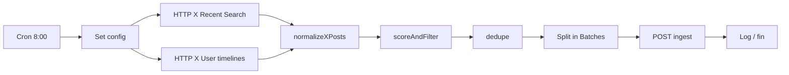

# Workflow n8n: Notitendencias - X AI Radar

Orquesta la consulta a la API de X, normalización, scoring, deduplicación e ingesta en Notitendencias.

**Nombre del workflow:** `Notitendencias - X AI Radar`  
**Estado recomendado:** desactivado hasta configurar credenciales y probar con pocos posts.

---

## Variables en n8n

Configurar en **Settings → Variables** (o credenciales) del entorno n8n:

| Variable | Ejemplo | Notas |
|----------|---------|--------|
| `X_BEARER_TOKEN` | (secreto) | API v2 Bearer de X Developer Portal |
| `X_API_MAX_POSTS_PER_RUN` | `50` | Límite por ejecución |
| `X_API_MAX_POSTS_PER_DAY` | `100` | Contador acumulado (nodo Code opcional) |
| `NOTITENDENCIAS_INGEST_URL` | `https://notitendencias.iareal.net/api/bridge/ingest` | |
| `BRIDGE_API_KEY` | (secreto) | Igual que en la app |

Lista editable en el nodo **Set config** (JSON):

```json
{
  "keyAccounts": ["OpenAI", "AnthropicAI", "GoogleDeepMind", "GoogleAI", "MetaAI", "Microsoft", "NVIDIAAI", "huggingface", "Perplexity_AI", "MistralAI", "deepseek_ai", "ycombinator", "ProductHunt"],
  "queries": [
    "\"AI agent\" lang:en",
    "\"OpenAI\" lang:en",
    "\"Claude\" lang:en",
    "\"Gemini AI\" lang:en",
    "\"DeepSeek\" lang:en",
    "\"new AI tool\" lang:en",
    "\"AI startup\" lang:en",
    "\"vibe coding\" lang:en",
    "\"inteligencia artificial\" lang:es",
    "\"herramienta de IA\" lang:es",
    "\"agentes de IA\" lang:es",
    "\"automatización con IA\" lang:es"
  ],
  "maxPostsPerRun": 50
}
```

---

## Estructura del workflow



| # | Nodo | Tipo | Descripción |
|---|------|------|-------------|
| 1 | Cron diario | Schedule Trigger | 08:00 (zona del servidor n8n) |
| 2 | Set config | Set | Cuentas, queries, `maxPostsPerRun` |
| 3 | X Recent Search | HTTP Request | `GET https://api.x.com/2/tweets/search/recent?query=...` |
| 4 | X User timeline | HTTP Request | Por cuenta clave (si el plan lo permite) |
| 5 | normalizeXPosts | Code | Unifica tweets → payload Notitendencias |
| 6 | scoreAndFilter | Code | Puntuación y filtro (score ≥ 40) |
| 7 | dedupe | Code | Por `post_id` en la ejecución |
| 8 | Split in Batches | Split | Tamaño 1–5 para no saturar ingest |
| 9 | POST Notitendencias | HTTP Request | Bearer `BRIDGE_API_KEY` |
| 10 | Log | Code / Set | Resumen: enviados, descartados, errores |

---

## HTTP Request: X API (ejemplo)

**Recent search** (repetir por query o usar Loop):

- Method: `GET`
- URL: `https://api.x.com/2/tweets/search/recent`
- Query: `query={{ $json.query }}`, `max_results=10`, `tweet.fields=public_metrics,created_at,author_id,entities`, `expansions=author_id`, `user.fields=username,name`
- Header: `Authorization: Bearer {{ $vars.X_BEARER_TOKEN }}`

Ajustar según documentación actual de X API v2 y tu tier de acceso.

---

## Function: normalizeXPosts

Pegar en un nodo **Code** (JavaScript). Entrada: items con respuesta de X; salida: un item por hallazgo normalizado.

```javascript
const config = $('Set config').first().json;
const keyAccounts = new Set((config.keyAccounts || []).map((h) => h.toLowerCase()));
const items = $input.all();
const out = [];

function firstUrl(entities) {
  const urls = entities?.urls;
  if (!urls?.length) return '';
  return urls.find((u) => u.expanded_url && !u.expanded_url.includes('t.co'))?.expanded_url
    || urls[0].expanded_url
    || '';
}

function editorialTitle(text, username) {
  const t = (text || '').replace(/\s+/g, ' ').trim();
  if (t.length <= 100) return t.length ? t : `Señal de IA en @${username}`;
  return `Conversación de IA en @${username}: ${t.slice(0, 80)}…`;
}

for (const item of items) {
  const tweets = item.json.data || [];
  const users = {};
  for (const u of item.json.includes?.users || []) {
    users[u.id] = u;
  }
  const detectedQuery = item.json.detected_query || '';

  for (const tw of tweets) {
    const user = users[tw.author_id] || {};
    const username = user.username || 'unknown';
    const postId = tw.id;
    const text = tw.text || '';
    const externalUrl = firstUrl(tw.entities);

    out.push({
      json: {
        category: 'ia',
        source_name: 'X',
        source_url: `https://x.com/${username}/status/${postId}`,
        title: editorialTitle(text, username),
        raw_text: text.slice(0, 1500),
        detected_at: tw.created_at || new Date().toISOString(),
        metadata: {
          platform: 'x',
          signal_type: 'ai_trend',
          author: user.name || '',
          username,
          post_id: postId,
          likes: tw.public_metrics?.like_count ?? 0,
          reposts: tw.public_metrics?.retweet_count ?? 0,
          replies: tw.public_metrics?.reply_count ?? 0,
          quotes: tw.public_metrics?.quote_count ?? 0,
          detected_query: detectedQuery,
          relevance_reason: keyAccounts.has(username.toLowerCase())
            ? 'Cuenta clave de IA'
            : 'Coincide con query de radar',
          external_url: externalUrl,
          from_key_account: keyAccounts.has(username.toLowerCase()),
        },
      },
    });
  }
}

return out;
```

---

## Function: scoreAndFilter

```javascript
const KEYWORDS = /\b(launch|released|agent|model|AI tool|automation|OpenAI|Claude|Gemini|DeepSeek)\b/i;
const SPANISH = /\b(inteligencia artificial|herramienta|agentes|automatización|méxico|latam)\b/i;
const ARXIV = /arxiv\.org/i;

const items = $input.all();
const kept = [];

for (const item of items) {
  const j = item.json;
  const meta = j.metadata || {};
  const text = `${j.title || ''} ${j.raw_text || ''} ${meta.external_url || ''}`;
  let score = 0;

  if (meta.from_key_account) score += 30;
  if (KEYWORDS.test(text)) score += 20;
  if (meta.external_url) score += 15;
  const engagement = (meta.likes || 0) + (meta.reposts || 0) * 2;
  if (engagement >= 50) score += 10;
  if (SPANISH.test(text)) score += 10;

  if (ARXIV.test(text)) continue;
  if (score < 40) continue;

  meta.relevance_reason = meta.relevance_reason || `score=${score}`;
  j.metadata = meta;
  kept.push({ json: j });
}

return kept;
```

---

## Function: dedupe

```javascript
const seen = new Set();
const out = [];

for (const item of $input.all()) {
  const id = item.json.metadata?.post_id || item.json.source_url;
  if (!id || seen.has(id)) continue;
  seen.add(id);
  out.push(item);
}

return out;
```

---

## HTTP Request: POST a Notitendencias

| Campo | Valor |
|-------|--------|
| Method | `POST` |
| URL | `{{ $vars.NOTITENDENCIAS_INGEST_URL }}` |
| Authentication | Header `Authorization: Bearer {{ $vars.BRIDGE_API_KEY }}` |
| Content-Type | `application/json` |
| Body | `{{ JSON.stringify($json) }}` (o “Using JSON” con campos del item) |

Respuesta 200: `{ "ok": true, "item": { "id": "...", "status": "new", ... } }`.

---

## Creación automática (MCP / API)

1. **MCP n8n en Cursor:** si `create_workflow_from_code` está disponible, validar con `validate_workflow` y crear el workflow desactivado.
2. **Script del repo:** `npm run n8n:push` solo crea los workflows de webhooks/digest existentes; el radar X se documenta aquí para import manual.
3. **Import manual en n8n UI:**
   - Crear workflow vacío con el nombre `Notitendencias - X AI Radar`.
   - Añadir nodos según la tabla anterior.
   - Pegar los bloques Code de este documento.
   - Configurar variables y **no activar** hasta probar con `max_results` bajo.

Si la creación por MCP falla por credenciales, es esperado: completar variables en n8n y activar tras una prueba con 5 posts.

---

## Prueba con 5 posts

1. En Set config, limitar a 1–2 queries y `max_results=5`.
2. Ejecutar workflow manualmente (Test workflow).
3. Verificar en https://notitendencias.iareal.net/admin que aparecen filas con `source_name` = X y badge **X**.
4. Procesar uno con DeepSeek y revisar tono cauteloso.
5. Publicar manualmente solo si pasa revisión.

---

## Documentación relacionada

- [`docs/x-api-radar.md`](./x-api-radar.md) — estrategia, payload y filtrado
- [`docs/n8n-workflows.md`](./n8n-workflows.md) — webhooks al publicar tendencias
